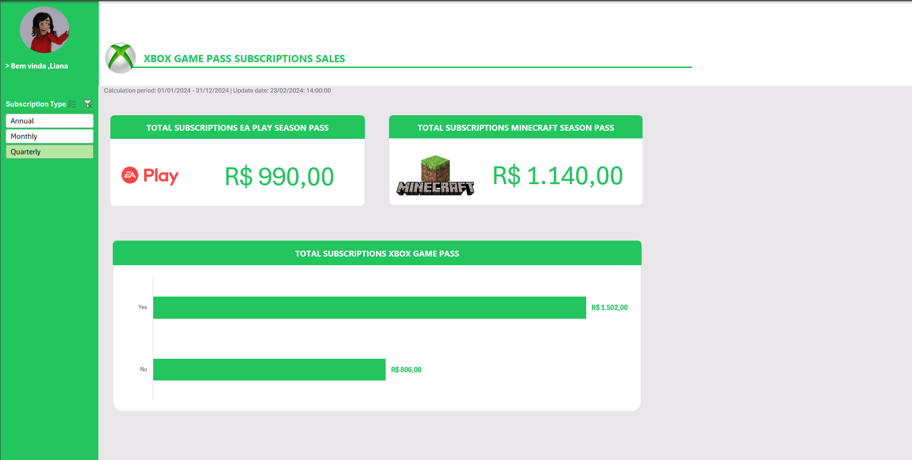

# 🎮 Dashboard de Vendas – Desafio DIO (Tema Xbox)

## 📌 Sobre o Projeto

Este projeto foi desenvolvido como parte de um desafio da **Digital Innovation One (DIO)**, com o objetivo de criar um **Dashboard de Vendas no Excel**, focado na organização, análise e visualização estratégica de dados.

A proposta consiste em transformar dados brutos em informações visuais claras e objetivas, permitindo análise eficiente do desempenho de vendas e apoio à tomada de decisão baseada em dados.

O dashboard foi construído com **tema inspirado no Xbox**, aplicando identidade visual moderna e organizada.

---

## 🖼️ Preview do Dashboard



---

## 🎯 Objetivos do Desafio

- Organizar dados de vendas
- Criar indicadores estratégicos (KPIs)
- Desenvolver gráficos dinâmicos
- Aplicar segmentações para análise interativa
- Construir layout visual temático

---

## 📊 Funcionalidades

- 📈 Faturamento total
- 🛒 Quantidade de vendas
- 📅 Análise por período
- 📊 Comparativos de desempenho
- 🎛️ Filtros interativos com segmentação de dados

---

## 🛠️ Ferramentas Utilizadas

- Microsoft Excel
  - Tabelas Dinâmicas
  - Gráficos Dinâmicos
  - Segmentação de Dados
  - Fórmulas para tratamento de dados
  - Customização visual (tema Xbox)

---
## 📁 Estrutura do Repositório

```
📦 dashboard-vendas-xbox-dio
 ┣ 📄 README.md
 ┣ 🖼️ preview.png
 ┗ 📊 Dashboard_Vendas_Xbox.xlsx
```
---

## ▶️ Como Reproduzir

1. Faça o download do arquivo `Dashboard_Vendas_Xbox.xlsx`
2. Abra no Microsoft Excel (versão 2016 ou superior recomendada)
3. Utilize os filtros para explorar os dados
4. Analise os indicadores e gráficos disponíveis

---

## 🚀 Resultado

O dashboard permite visualizar o desempenho de vendas de forma clara, identificar tendências e apoiar decisões estratégicas com base em dados organizados.

---

Desenvolvido para fins educacionais como parte do desafio prático da DIO.
